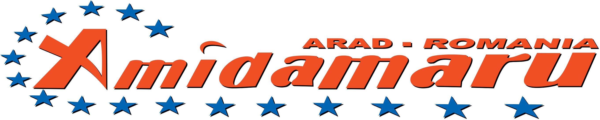

# 🚛 AMIDAMARU - Transport Internațional

<div align="center">



**Website oficial pentru S.C. AMIDAMARU S.R.L.**

Companie de transport rutier internațional de mărfuri din Arad, România

[](https://nextjs.org/)
[](https://react.dev/)
[](https://tailwindcss.com/)
[](https://www.typescriptlang.org/)

</div>

---

## 📋 Despre Proiect

Website profesional pentru **AMIDAMARU**, o companie de transport rutier internațional cu sediul în Arad, România. Site-ul prezintă serviciile companiei, flota modernă de camioane și oferă informații de contact pentru potențialii clienți.

### ✨ Caracteristici

- 🎨 **Design Modern & Profesional** - Interfață dark theme cu accente în culorile brandului (portocaliu și albastru)
- 📱 **Fully Responsive** - Optimizat pentru toate dispozitivele
- 🖼️ **Galerie Flotă** - Prezentare vizuală a camioanelor Volvo și Iveco
- 📍 **Integrare Google Maps** - Localizare sediu
- 📧 **Formular de Contact** - Pentru cereri de ofertă și colaborări
- ⚡ **Performanță Optimizată** - Built cu Next.js 16 pentru încărcare rapidă
- 🔍 **SEO Optimizat** - Metadata configurată pentru vizibilitate maximă

## 🏢 Informații Companie

| | |
|---|---|
| **Denumire** | S.C. AMIDAMARU S.R.L. |
| **Sediu** | Str. Centura Nord Km 541+150 Cart. MICALACA (DN 7), Arad, România |
| **CUI** | RO18556425 |
| **Reg. Comerț** | J02/623/2006 |

## 🚀 Instalare & Rulare

```bash
# Clonare repository
git clone https://github.com/[username]/web-amidamaru.git

# Navigare în director
cd web-amidamaru

# Instalare dependențe
npm install

# Configurare environment variables (vezi secțiunea de mai jos)

# Rulare în mod development
npm run dev

# Build pentru producție
npm run build

# Rulare build producție
npm start
```

Deschide [http://localhost:3000](http://localhost:3000) în browser.

## 🔐 Environment Variables

Pentru ca formularul de contact să funcționeze, trebuie să configurezi variabilele de mediu:

### 1. Creează fișierul `.env.local`

```bash
# În directorul proiectului, creează fișierul .env.local
NEXT_PUBLIC_WEB3FORMS_KEY=your_access_key_here
```

### 2. Obține cheia Web3Forms (GRATUIT)

1. Accesează [web3forms.com](https://web3forms.com)
2. Click pe "Create Access Key"
3. Introdu email-ul unde vrei să primești mesajele de contact
4. Confirmă email-ul și copiază Access Key
5. Înlocuiește `your_access_key_here` cu cheia primită

> ⚠️ **Important:** Fișierul `.env.local` NU trebuie adăugat în Git (este deja în .gitignore)

## 🛠️ Tech Stack

- **Framework:** Next.js 16.1 (App Router)
- **UI Library:** React 19
- **Styling:** Tailwind CSS 4
- **Language:** TypeScript 5
- **Fonts:** Bebas Neue, Rajdhani (Google Fonts)

## 📁 Structura Proiectului

```
web-amidamaru/
├── app/
│   ├── globals.css      # Stiluri globale & tema
│   ├── layout.tsx       # Layout principal
│   └── page.tsx         # Pagina principală
├── public/
│   ├── images/          # Imagini flotă & sediu
│   └── logo.png         # Logo companie
└── ...
```

## 📄 Licență

**Proprietary License** - Toate drepturile rezervate © 2026 Jungean-Herman Marius-Alexandru

S.C. AMIDAMARU S.R.L. deține drept de utilizare și comercializare asupra acestui website.

Vezi fișierul [LICENSE](LICENSE) pentru detalii complete.

---

<div align="center">

**Dezvoltat cu ❤️ pentru AMIDAMARU**

🌐 [amidamaru.ro](https://amidamaru.ro)

</div>
